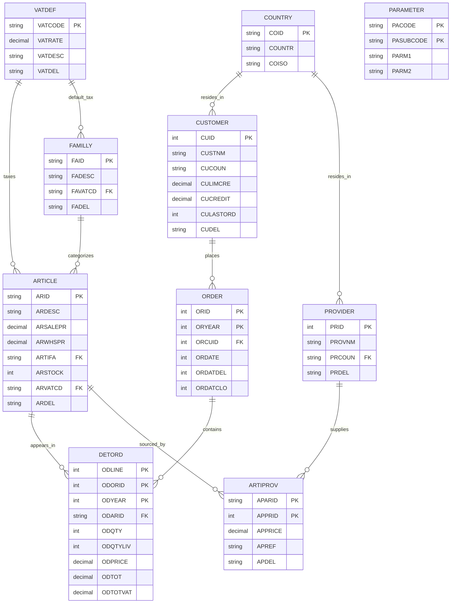
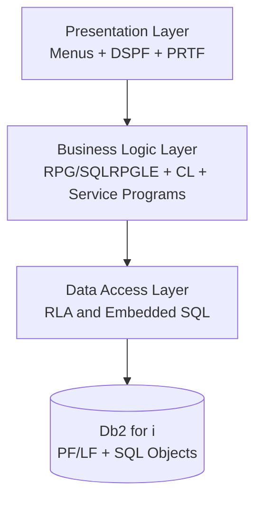
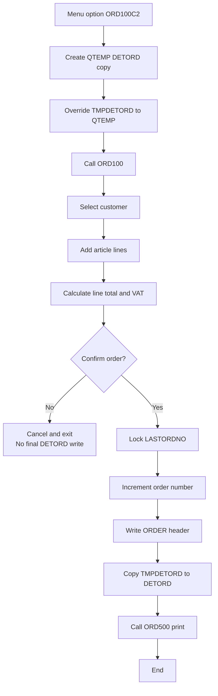
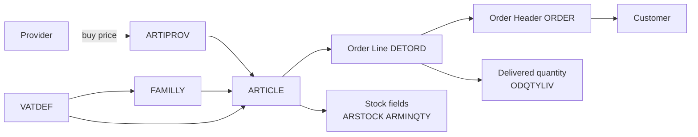
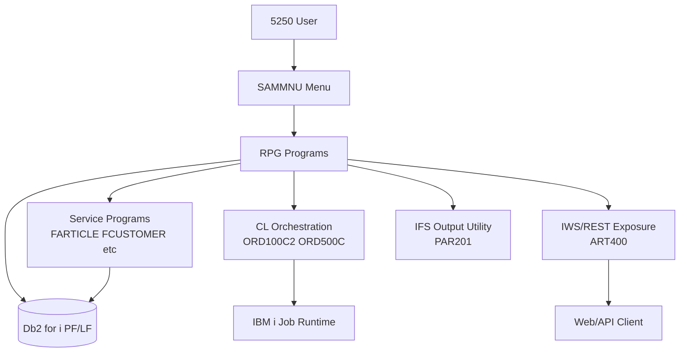
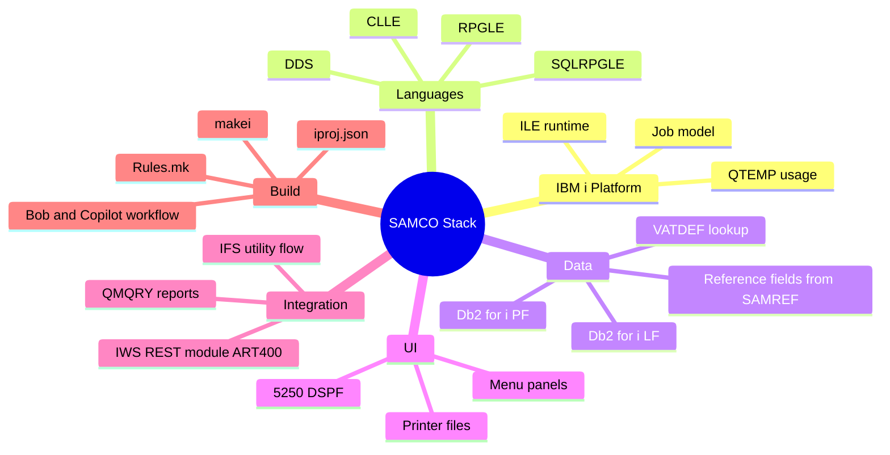

# SAMCO Architecture Diagrams (Lab 0 Step 4)

## 1. Entity Relationship Diagram (ERD)

## 2. Application Layer Architecture

## 3. Business Process Flow: Order Processing

## 4. Data Flow Diagram: Inventory and Sales Cycle

## 5. System Integration Architecture

## 6. Menu Structure Hierarchy

```mermaid
flowchart TD
    M[SAMMNU Main Menu]

    M --> MF[Master files]
    MF --> MF1[ART200 Work with Articles]
    MF --> MF2[CUS200 Work with Customers]
    MF --> MF3[ORD201 Work with Customer Orders]
    MF --> MF4[PRO200 Work with Providers]
    MF --> MF5[PRO201 Display Providers]
    MF --> MF6[ORD100C2 Create Customer Order]

    M --> RP[Reports]
    RP --> RP1[PRO203 Article to purchase]
    RP --> RP2[CUSQRY Customer with open order]
    RP --> RP3[ARTQRY Article by last order date]

    M --> UT[Utilities]
    UT --> UT1[PAR200 Parameters]
    UT --> UT2[COU200 Countries]
    UT --> UT3[ORD900 Reset LASTORDNO]
    UT --> UT4[ORD901 Reset order dates]
    UT --> UT5[ART801 Reset summary fields]
    UT --> UT6[PAR201 IFS output]
    UT --> UT7[Display application log]
    M --> SO[Signoff]
```

## 7. Technology Stack Overview

